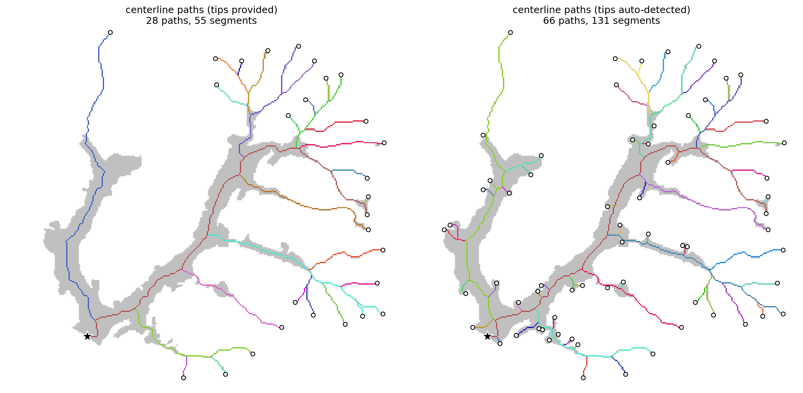
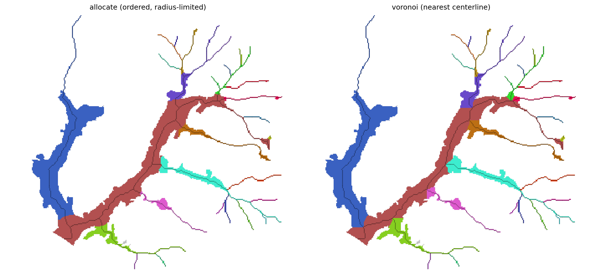
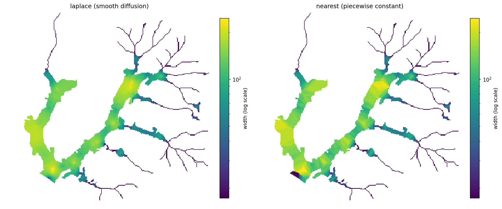

# branch

Characterize binary branching shapes — rivers, valley floors, floodplains, glaciers, roots.
Given a shape mask, a root point, and (optionally) branch tips, `branch` extracts a
topology-aware centerline network, decomposes it into hierarchically ordered paths,
allocates every pixel of the shape to its path, and estimates local width everywhere.


## Install

```bash
pip install git+https://github.com/avkoehl/branch.git
```

Development (clone, then sync with dev extras):

```bash
git clone https://github.com/avkoehl/branch.git
cd branch
uv sync --extra dev
```

## Usage

```python
import branch
from branch.data import load

mask, root, tips = load()                       # bundled toy dataset

result = branch.analyze(mask, root, tips=tips)  # tips optional; auto-detected if omitted
result.network.segments                         # DataFrame: segment_id, path_id, strahler,
                                                #   length, weight, downstream_segment_id
result.regions                                  # labeled raster: each pixel -> its path
result.widths                                   # float raster: local width everywhere
```

Inputs are `np.ndarray` (with `pixel_size=`) or georeferenced `xr.DataArray`;
outputs match the input type. `root` and `tips` are `(row, col)` pixel coordinates.

## Components

`analyze` composes three independent primitives. Each is usable on its own.

### Centerlines — `extract`

Skeletonizes the mask, routes from tips to root (pruning everything else), and
decomposes the network into paths — at each junction the "heaviest" branch continues
(`path_by="area" | "length" | "strahler"`; `path_id == 1` is the mainstem). With no
tips provided, every skeleton endpoint becomes a tip.



### Partitioning — `allocate`, `voronoi`

`allocate` assigns every pixel to a path: paths claim territory in priority order,
each limited by the local shape radius, so wide branches claim proportionally more
space at junctions. `voronoi` is the unordered nearest-centerline baseline —
compare them at the confluences:



`subdivide(regions, network)` splits each path's territory by its segments.

### Widths — `widths`, `region_widths`

Exact widths (2 × distance-to-boundary) at the centerline, interpolated across the
shape (`method="laplace" | "nearest"`). `region_widths` interpolates independently
within each region so widths never diffuse across path boundaries:


