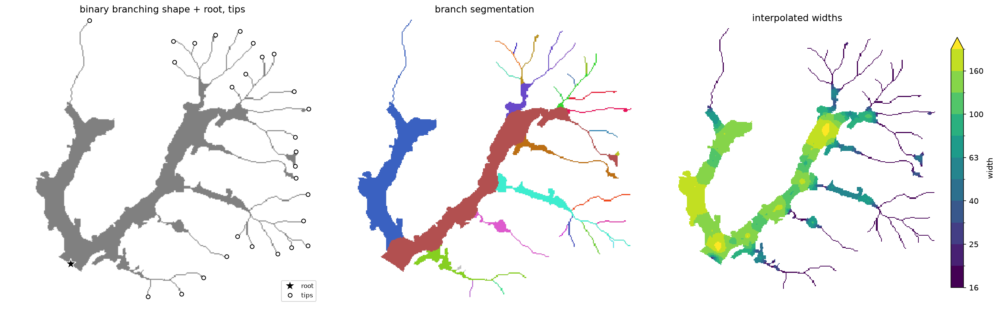
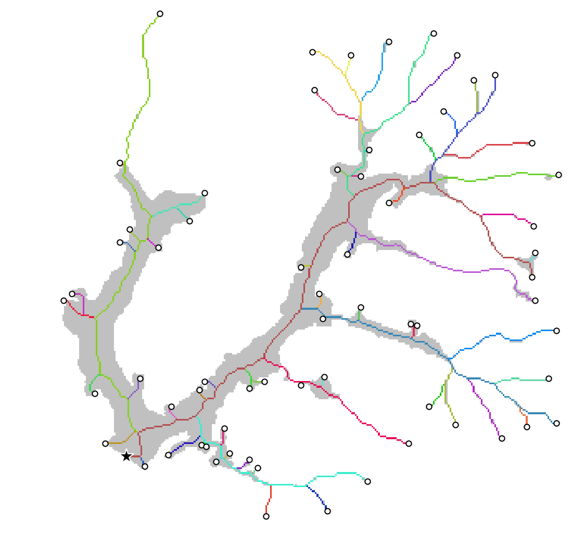
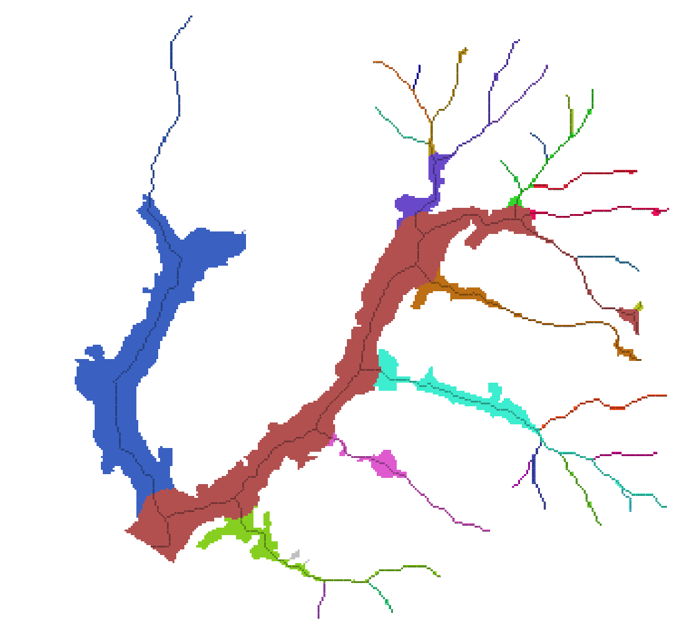
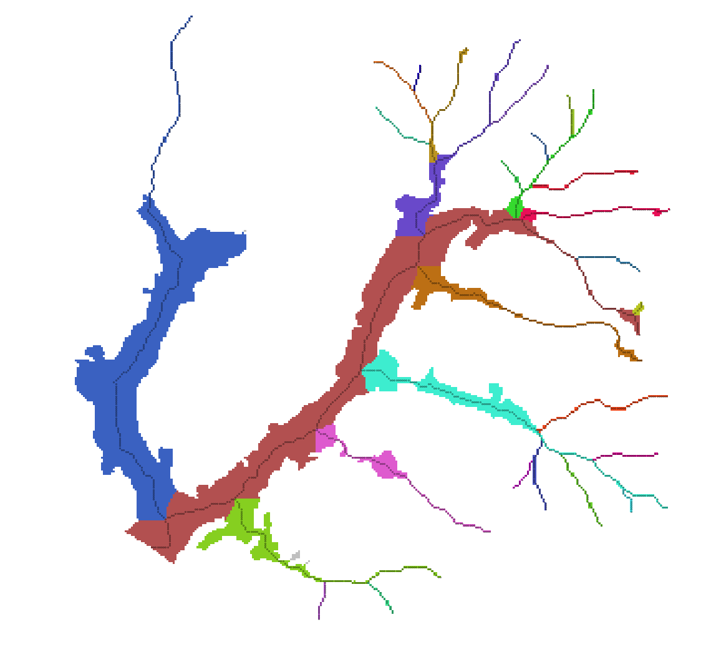
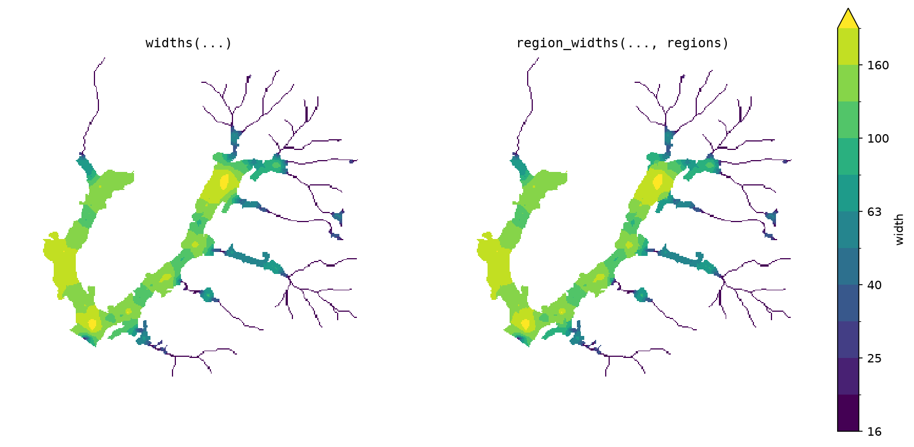
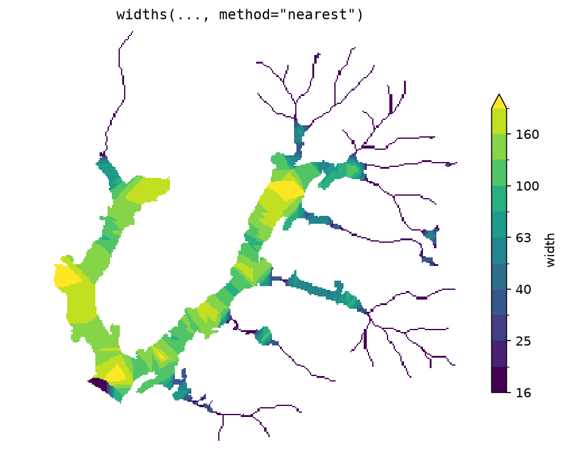
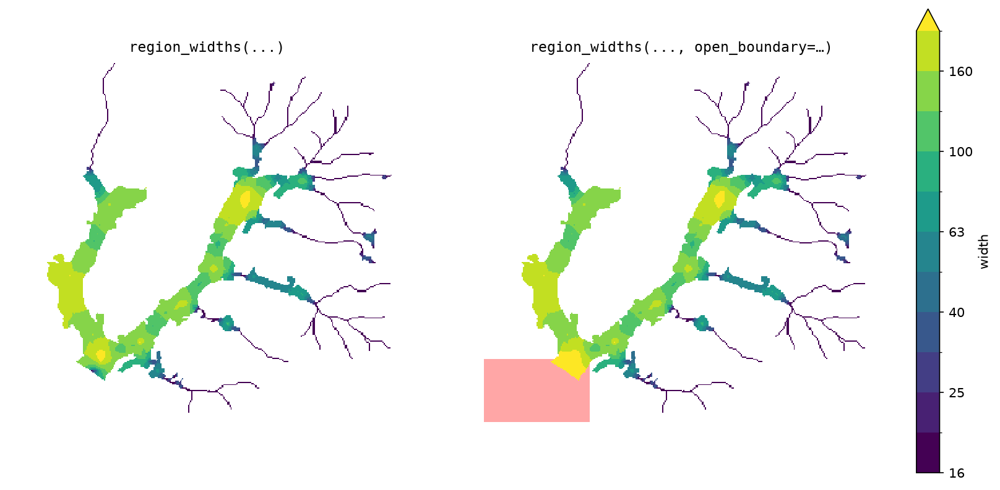

# branch

Characterize binary branching shapes (e.g. rivers, floodplains, glaciers,
roots, veins...). Given a shape mask, a root point, and (optionally) branch
tips, `branch` extracts a topology-aware centerline network, decomposes it into
hierarchically ordered paths, allocates every pixel of the shape to its path,
and estimates local width everywhere.



## Install

```bash
pip install git+https://github.com/avkoehl/branch.git
```

Development (clone, then sync with dev extras):

```bash
git clone https://github.com/avkoehl/branch.git
cd branch
uv sync --extra dev
```

## Usage

```python
import branch
from branch.data import load

mask, root, tips = load()                       # bundled toy dataset

net = branch.extract(mask, root, tips=tips)     # centerline network of ordered paths
regions = branch.allocate(mask, net.rasterize(by="path"))
widths = branch.region_widths(mask, net.rasterize(), regions)

net.segments                                    # DataFrame: segment_id, path_id, strahler,
                                                #   length, weight, downstream_segment_id
regions                                         # labeled raster: each pixel -> its path
widths                                          # float raster: local width everywhere
```

Inputs are `np.ndarray` (with `pixel_size=`) or georeferenced `xr.DataArray`;
outputs match the input type. `root` and `tips` are `(row, col)` pixel coordinates.

## Components

Each individual component is presented below.

### Centerlines

```python
net = branch.extract(mask, root, tips=tips)
```

Skeletonizes the mask, routes from each tip to the root (pruning everything else),
and decomposes the network into ordered paths — `path_id == 1` is the mainstem.


```python
net = branch.extract(mask, root)
```

Without tips, every skeleton endpoint becomes a tip.



Tips and root can often be derived automatically — glacier branch tips
[Kienholz et al.,
2014](https://tc.copernicus.org/articles/8/503/2014/tc-8-503-2014.pdf), channel
initiation points, or the lowest point on the boundary as the root — or simply
digitized in GIS software.


### Partitioning

```python
regions = branch.allocate(mask, net.rasterize(by="path"))
```

Assigns every pixel to a path: paths claim territory in priority order, each limited
by the local shape radius, so wide branches claim proportionally more space at junctions.



```python
regions = branch.voronoi(mask, net.rasterize(by="path"))
```

Nearest-centerline partition — no ordering, no radius limits.



```python
seg_regions = branch.subdivide(regions, net)
```

Subdivides each path's territory further: within a territory, every pixel goes to
its nearest centerline segment of that same path.


### Widths

Exact widths (twice the distance to the boundary) are taken at the centerline and
interpolated across the shape. That interpolation runs either over the whole shape
or independently within each region, which keeps junction-zone pixels from
averaging between a branch and its mainstem:

```python
w = branch.widths(mask, net.rasterize())
w = branch.region_widths(mask, net.rasterize(), regions)
```



Either call also takes `method="nearest"`, which gives each pixel the width of its
nearest centerline pixel instead of diffusing smoothly from it — piecewise
constant, and much faster:

```python
w = branch.widths(mask, net.rasterize(), method="nearest")
```



## Open boundaries

Everything above measures local half-width as the distance from each pixel to the
shape's boundary, and that half-width drives three things: which branch is the
mainstem, how far each path claims territory, and the width field. By default
every boundary pixel is treated as a **wall**. Sometimes part of the boundary is
not a real wall — the shape is truncated by open water, the data extent, or
another medium — and treating it as one makes the half-width collapse to zero
there.

Pass `open_boundary`: a binary mask, on the same grid as the shape, marking the
non-wall (void) pixels. Distances are then measured only to the remaining real
walls. It is optional — omitted, every boundary is a wall (the behaviour above) —
and accepted by `extract`, `allocate`, `widths`, and `region_widths`. Give it to
every step, so all three stages measure against the same walls:

```python
net = branch.extract(mask, root, tips=tips, open_boundary=open_boundary)
regions = branch.allocate(mask, net.rasterize(by="path"), open_boundary=open_boundary)
widths = branch.region_widths(mask, net.rasterize(), regions,
                              open_boundary=open_boundary)
```

Below, the same mask, root, and tips are reused, but the void past the outlet is
marked open (shaded red), and the outlet `widths` no longer taper to the cut edge.
Mark a region with depth rather than a thin skin along the boundary: distances are
measured *through* the open void, so a one-pixel rind would only push the wall out
by one pixel. 



Only the widths are shown because on this shape the partitioning didn't change.
