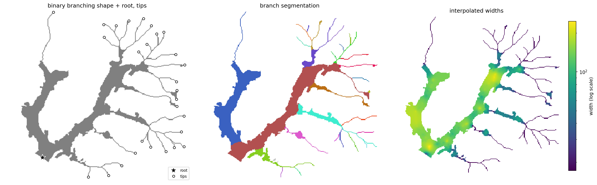
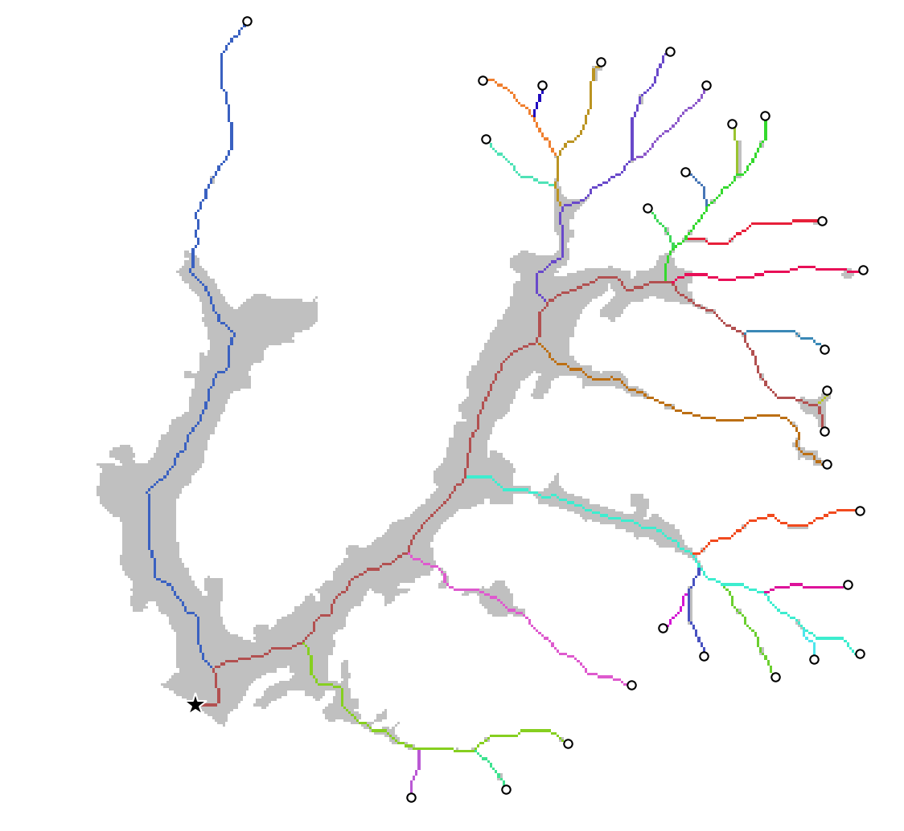
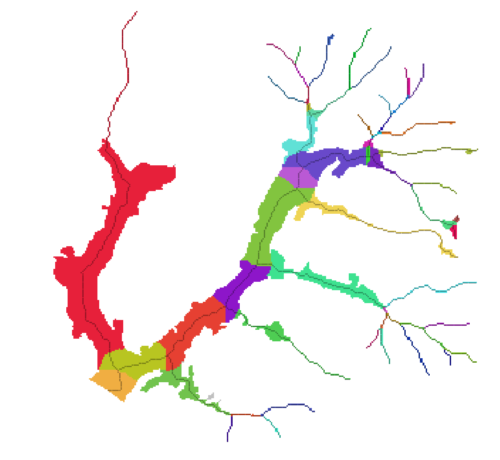
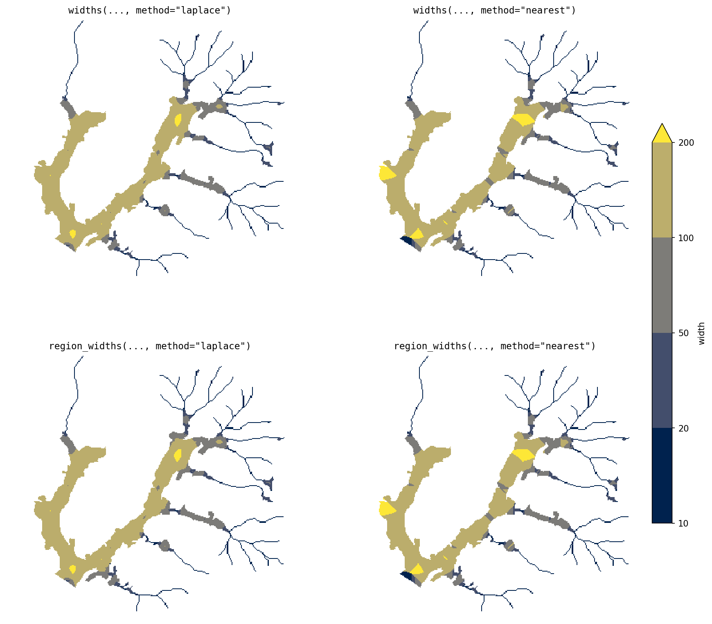

# branch

Characterize binary branching shapes — rivers, valley floors, floodplains, glaciers, roots.
Given a shape mask, a root point, and (optionally) branch tips, `branch` extracts a
topology-aware centerline network, decomposes it into hierarchically ordered paths,
allocates every pixel of the shape to its path, and estimates local width everywhere.



## Install

```bash
pip install git+https://github.com/avkoehl/branch.git
```

Development (clone, then sync with dev extras):

```bash
git clone https://github.com/avkoehl/branch.git
cd branch
uv sync --extra dev
```

## Usage

```python
import branch
from branch.data import load

mask, root, tips = load()                       # bundled toy dataset

result = branch.analyze(mask, root, tips=tips)
result.network.segments                         # DataFrame: segment_id, path_id, strahler,
                                                #   length, weight, downstream_segment_id
result.regions                                  # labeled raster: each pixel -> its path
result.widths                                   # float raster: local width everywhere
```

Inputs are `np.ndarray` (with `pixel_size=`) or georeferenced `xr.DataArray`;
outputs match the input type. `root` and `tips` are `(row, col)` pixel coordinates.

## Components

`analyze` composes the functions below. Each is usable on its own.

### Centerlines

```python
net = branch.extract(mask, root, tips=tips)
```

Skeletonizes the mask, routes from each tip to the root (pruning everything else),
and decomposes the network into ordered paths — `path_id == 1` is the mainstem.




```python
net = branch.extract(mask, root)
```

Without tips, every skeleton endpoint becomes a tip.


Tips and root can often be derived automatically — glacier branch tips
[Kienholz et al.,
2014](https://tc.copernicus.org/articles/8/503/2014/tc-8-503-2014.pdf), channel
initiation points, or the lowest point on the boundary as the root — or simply
digitized in GIS software.


### Partitioning

```python
regions = branch.allocate(mask, net.rasterize(by="path"))
```

Assigns every pixel to a path: paths claim territory in priority order, each limited
by the local shape radius, so wide branches claim proportionally more space at junctions.


```python
regions = branch.voronoi(mask, net.rasterize(by="path"))
```

Nearest-centerline partition — no ordering, no radius limits.


```python
seg_regions = branch.subdivide(regions, net)
```

Splits each path's territory into per-segment territories.



### Widths

Width estimation makes two independent choices: the **interpolator** —
`laplace` (smooth diffusion from the centerline) or `nearest` (each pixel takes
its nearest centerline pixel's width) — and the **domain** — the whole shape
(`widths`) or independently within each partitioned region (`region_widths`),
which keeps junction-zone pixels from averaging between a branch and its
mainstem at junctions.

```python
w = branch.widths(mask, net.rasterize(), method="laplace")
w = branch.widths(mask, net.rasterize(), method="nearest")
w = branch.region_widths(mask, net.rasterize(), regions, method="laplace")
w = branch.region_widths(mask, net.rasterize(), regions, method="nearest")
```


